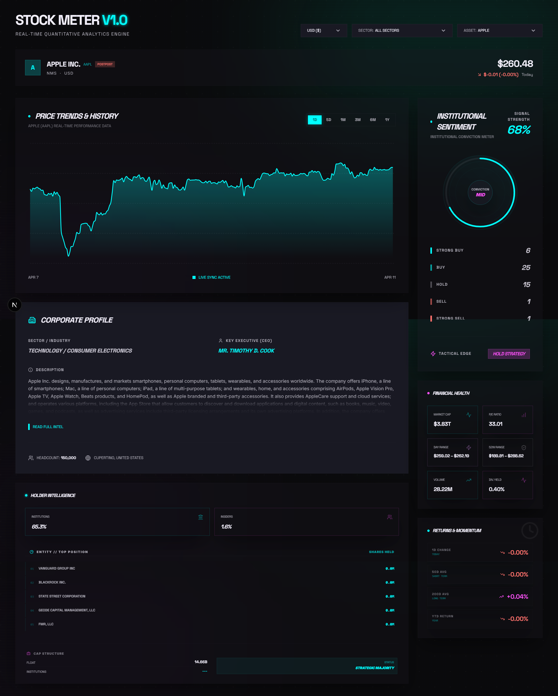

# 💹 StockMeter V1.0: Tactical Quantitative Terminal

A high-performance, real-time stock analytics dashboard built for professional-grade market monitoring. Designed with a sleek, low-latency interface that mimics institutional quantitative terminals like Bloomberg or FactSet.



## 🎯 Use Case
StockMeter is designed for **active traders and quantitative analysts** who require a unified view of market performance, corporate structure, and institutional sentiment. It serves as a "Mission Control" for monitoring high-conviction assets with live-synced intelligence.

## 🚀 Core Features

- **SWR-Powered Data Layer**: Migrated from Redux thunks to a high-performance hook-based architecture with automatic revalidation, deduplication, and caching.
- **Real-Time Market Sync**: Live quote updates every 5 seconds via background polling.
- **Holder Intelligence Engine**: Comprehensive breakdown of **Institutional vs. Insider ownership**, including top 5 institutional positions and market float analysis.
- **Sector-Specific Filtering**: New multi-layer filtering system (Sector -> Asset) to navigate 30+ global stocks across Finance, Tech, Energy, and more.
- **Dynamic Currency Engine**: On-the-fly conversion between USD, INR, EUR, and GBP with localized formatting.
- **Institutional Conviction Meter**: Visualized analyst recommendation trends (Buy/Sell/Hold) with signal strength scoring.
- **Balanced Tactical Layout**: Re-engineered dual-column layout ensuring main analytics and tactical metrics end at a unified baseline.

## 🛠 Tech Stack & Dependencies

| Category | Package | Use Case |
| :--- | :--- | :--- |
| **Framework** | `next` (v16) | React framework for SSR, optimized routing, and API handling. |
| **Data Orchestration** | `swr` | **NEW**: Handles all data fetching, caching, and background polling logic. |
| **Global UI State** | `@reduxjs/toolkit` | Manages user preferences (Selected Asset, Sector, Currency, Date Range). |
| **Market Data** | `yahoo-finance2` | Backend engine for real-time quotes, summaries, and historical charts. |
| **Visualization** | `recharts` | Used for drawing high-fidelity price gradients and performance lines. |
| **Iconography** | `lucide-react` | Sharp, semantic terminal-themed icons. |
| **Styling** | `tailwind-css` | Atomic utility-first styling for the terminal aesthetic. |

## 🔗 Custom Hook Layer (Frontend)
The application uses a centralized hook system located in `hooks/` to manage all external data:

- `useStockQuote(symbol)`: Fetches live price data with a **5-second polling interval**.
- `useStockChart(symbol, range)`: Manages historical time-series data; re-fetches instantly when range changes.
- `useStockSummary(symbol)`: Retrieves heavy company profile and ownership data with a **5-minute cache**.
- `useExchangeRate(currency)`: Synchronizes the global currency multiplier (1-hour cache).

## 📡 API Reference (Backend)

| Endpoint | Return Data | Ownership Info |
| :--- | :--- | :--- |
| `/api/stock/quote/[symbol]` | Current price, day range, volume, 52W high/low. | N/A |
| `/api/stock/chart/[symbol]` | Time-series array (Date, Price, Open, High, Low, Volume). | N/A |
| `/api/stock/summary/[symbol]` | Asset profile, Financial data, Analyst trends. | **Yes**: Incl. `majorHoldersBreakdown` & `institutionOwnership`. |
| `/api/stock/exchange-rate/[ccy]`| Latest conversion rate vs USD. | N/A |

## 🧠 Architecture Evolution
Originally built on a Redux-heavy thunk architecture, the project has been refactored to prioritize UI stability:
1. **Redux** now only tracks "What the user wants to see" (Intent).
2. **SWR Hooks** track "What the API is currently sending" (Data).
3. This separation prevents UI flickering and ensures common data (like exchange rates) is shared across components without redundant network calls.

## 📥 Setup and Installation

1. **Clone and Install**:
```bash
npm install
```

2. **Environment Configuration**:
   Create a `.env.local` file (refer to `.env.example`).

3. **Development Mode**:
```bash
npm run dev
```
