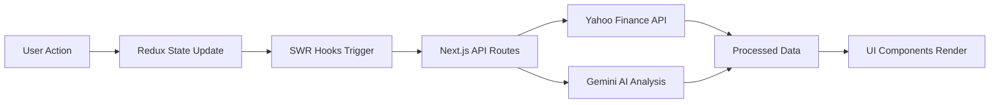

# 📈 StockMeter: Project Knowledge Transfer (KT) Document

This document provides a structured and professional technical overview of the **StockMeter** application, including architecture, data flow, core features, and development standards.

---

# 1. 🚀 Executive Summary

**StockMeter** is a financial intelligence platform built for quantitative analysis and real-time market monitoring. It combines institutional-grade market data with AI-powered insights.

## Key Capabilities

* 📊 **Real-Time Dashboards** – High-frequency price and volume tracking
* 🏛 **Ownership Intelligence** – Institutional vs. insider holdings analysis
* 🧠 **AI Sentiment Analysis** – News-based insights powered by Google Gemini
* 🌍 **Global Currency Engine** – Multi-currency financial data conversion

---

# 2. 🏗 Architecture Overview

## 2.1 Technology Stack

### Frontend

* Next.js 16 (React 19)
* Tailwind CSS
* Recharts

### State Management

* **Redux Toolkit** → Persistent UI state
* **SWR** → Real-time and server data handling

### Backend

* Next.js API Routes (Node.js runtime)

### External Integrations

* Yahoo Finance → Market Data
* Google Gemini → AI Sentiment Analysis

---

## 2.2 Data Flow



### Flow Explanation

1. User selects stock or currency
2. Redux updates UI state
3. SWR hooks detect change
4. Backend APIs fetch fresh data
5. AI generates insights
6. UI updates automatically

---

# 3. 📁 Directory Structure

| Path                  | Description                              |
| --------------------- | ---------------------------------------- |
| `app/api/`            | Backend endpoints for data + AI          |
| `components/`         | UI components (charts, cards, dropdowns) |
| `hooks/`              | SWR data fetching logic                  |
| `lib/redux/`          | Global state management                  |
| `lib/stockMapping.ts` | Stock + sector registry                  |
| `lib/formatters.ts`   | Number formatting utilities              |

---

# 4. ⚙️ Feature Breakdown

## 📊 Real-Time Market Monitor

* Live quotes refreshed every **5 seconds**
* Interactive price charts using Recharts
* 52-week high/low indicators
* Volume density tracking

## 🧠 Tactical AI Insights

* Market Pulse (2-line explanation)
* Sentiment classification (Bullish / Bearish)
* AI-generated key signals (bullet points)

## 🏛 Institutional Intelligence

* Ownership distribution (Institutions / Insiders / Public)
* Top 5 institutional holders
* Key financial metrics (P/E, Market Cap, Profitability)

---

# 5. 🧑‍💻 Development & Coding Standards

## Component Guidelines

* Use **Functional Components**
* Define **TypeScript interfaces** for props
* Reuse shared UI components

## Data Fetching Rules

* ❌ No direct API calls in components
* ✅ Use custom hooks (`hooks/`)
* Use SWR polling (`refreshInterval`)

## State Management

* Redux → UI intent (selected stock, filters)
* SWR → API data caching

## Styling

* Dark theme ("Tactical Terminal")
* Gradient accents
* Clean, minimal UI

---

# 6. 🔧 Extending the Project

## Adding a New Stock

1. Open `lib/stockMapping.ts`
2. Add stock metadata to `STOCKS` array
3. UI updates automatically

## Modifying AI Prompts

1. Navigate to:
   `app/api/stock/insights/[symbol]/route.ts`
2. Update the prompt string
3. Adjust tone, depth, or structure

---

# 7. ⚙️ Configuration

## Environment Variables

```bash
GOOGLE_GENAI_API_KEY=your_api_key_here
```

## Dependencies

* yahoo-finance2 → Market data
* Google Gemini API → AI processing

---

# 📌 Summary

StockMeter is designed with a **clean separation of concerns**:

* UI → React components
* State → Redux + SWR
* Data → API routes
* Intelligence → AI layer

This architecture ensures:

* Scalability
* Maintainability
* Real-time responsiveness

---

*📄 Compiled by Antigravity AI – Refined for clarity and engineering standards.*
